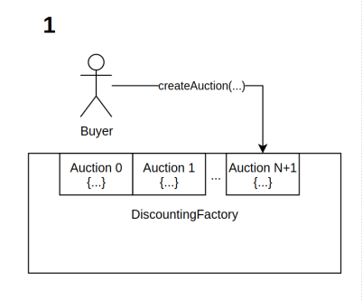
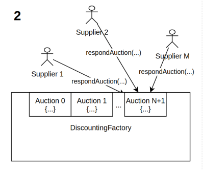
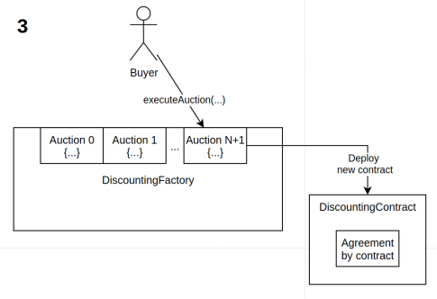
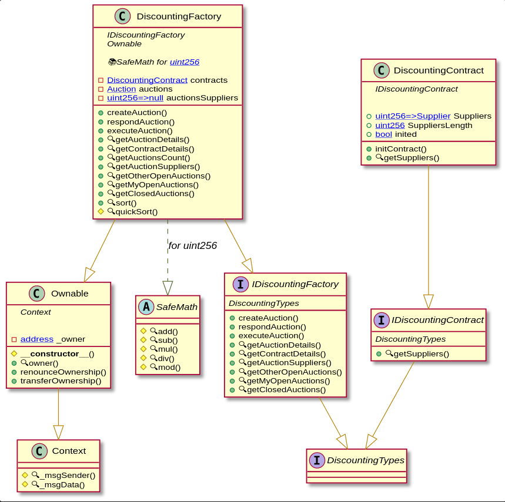

# Dynamic discounting system implementation

Смарт-контракты, реализующие аукцион для торгов с динамическим дисконтом.

- Язык: Solidity v0.6.2

- Проект для сборки: truffle ^5.1.44

Совместимо с любыми Ethereum-like сетями. С незначительными доработками совместимо с иными сетями, поддерживающими EVM, а также с Parity Substrate, Solana, hyperledger Sawtooth (благодаря Solang Solidity Compiler).

## Структура проекта:
```
contracts/
├── discounting
│   ├── DiscountingContract.sol
│   ├── DiscountingFactory.sol
│   ├── DiscountingTypes.sol
│   ├── IDiscountingContract.sol
│   └── IDiscountingFactory.sol
└── supplyOrderPrototype
    ├── SupplyOrderContract.sol
    ├── SupplyOrderFactory.sol
    └── SupplyOrderTypes.sol
```

- __discounting__ - система аукциона для предложений с динамическим дисконтом, реализация задачи кейса №5

- __supplyOrderPrototype__ - прототип системы заключения и ведения сделок между поставщиком и заказчиком, далее ниже не рассматривается

## Как это работает:





## Основные методы и контракты:

| Контракт | Метод | Входные данные | Описание |
| --- | --- | --- | --- |
| DiscountingFactory | --- | --- | --- |
| --- | createAuction | uint256 _hasAmount, uint256 _minPercent | Создать аукцион в лице заказчика для предложений с динамическим дисконтом. _hasAmount - свободные средства, которые заказчик готов направить на раннюю оплату. _minPercent минимальная процентная ставка, которая может рассматриваться|
| --- | respondAuction | uint256 _id, uint256 _needAmount, uint256 _discountPercent | Отозваться на аукцион в лице поставщика и выдвинуть своё предложение. _id - идентификатор аукциона, _needAmount - предлагаемая сумма для ранней оплаты, _discountPercent - предлагаемая ставка дисконтирования|
| --- | executeAuction | uint256 _id | Закрыть аукцион и провести автоматический процесс достижения договорённостей, после чего выпускается смарт-контракт __DiscountingContract__, где жестко фиксируется результат аукциона и все договоренности, _id - идентификатор целевого аукциона. |
| --- | getAuctionDetails | uint256 _id | Получить детальную информацию по аукциону, _id - идентификатор целевого аукциона. |
| --- | getContractDetails | address _contractAddress | Получить детальную информацию по смарт-контракту, выпущеному ранее в результате закрытия аукциона, _contractAddress - адрес целевого смарт-контракта. |
| --- | getAuctionsCount | --- | Получить количество аукционов в принципе. |
| --- | getAuctionSuppliers | uint256 _id | Получить предложения поставщиков, отозвавшихся на аукцион, _id - идентификатор целевого аукциона. |
| --- | getOtherOpenAuctions | --- | Получить идентификаторы открытых аукционов других участников |
| --- | getMyOpenAuctions | --- | Получить идентификаторы своих открытых аукционов |
| --- | getClosedAuctions | --- | Получить идентификаторы всех закрытых аукционов |
| DiscountingContract | --- | --- | --- |
| --- | getSuppliers | --- | Получить информацию о заключенных договоренностях |


## UML-диаграмма контрактов:



## Installation & Usage

Require truffle
```
npm i -g truffle
```

Install local packages
```
npm i
```

Build project:
```
npm build
```

For external networks use ENV "`PRIVATE_KEY`".

[Пример работы с контрактом](./example/web3Example.js) (представлены некоторые методы)

